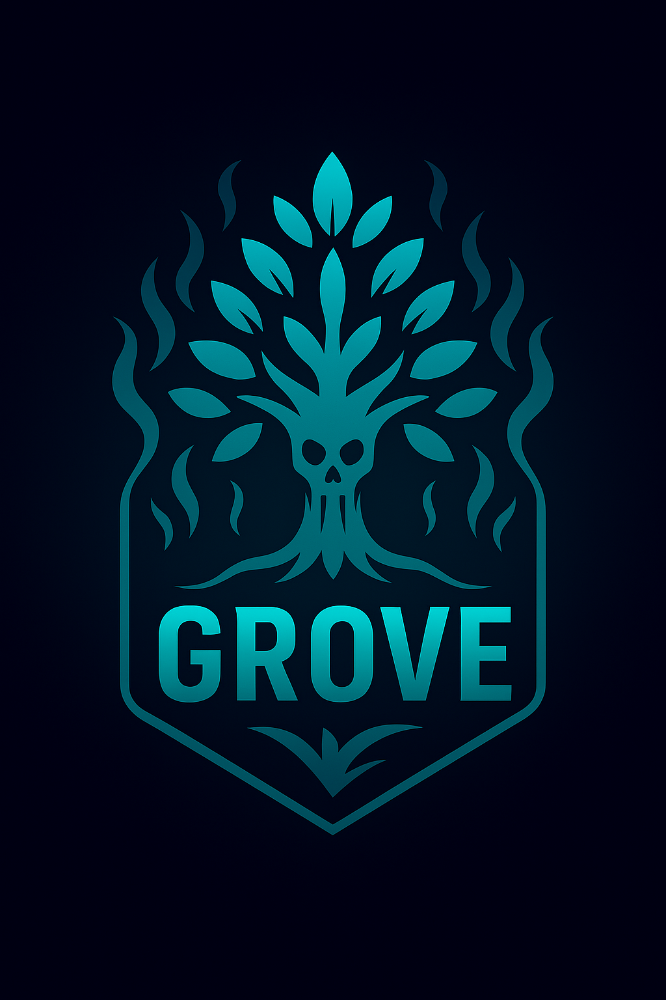

# Grove




A high-performance Tree-sitter wrapper for Zig, designed to provide safe, ergonomic syntax highlighting and parsing for the Grim text editor.

## Overview

Grove is a modern Zig wrapper around the Tree-sitter parsing library, focusing on:

- **Safety**: RAII resource management with no UB on moved trees
- **Performance**: Zero-copy rope integration and incremental parsing
- **Ergonomics**: Clean Zig API over the proven Tree-sitter runtime
- **Integration**: Purpose-built for text editors with LSP support

## Bundled Grammars

- **Zig** (`maxxnino/tree-sitter-zig` – commit a80a6e9, vendored). Exposed via `grove.Languages.zig.get()`.
- **JSON** (`tree-sitter-json` – master @ 2024-09-24). Available via `grove.Languages.json.get()` for instant smoke tests.
- **Rust** (`tree-sitter-rust` – v0.25.3, vendored). Exposed via `grove.Languages.rust.get()` with scanner support.
- **Ghostlang** (`ghostlang/tree-sitter-ghostlang` – v0.1.0, vendored with local precedence fixes). Exposed via `grove.Languages.ghostlang.get()` and ships highlight/query bundles for `.ghost`/`.gza` files.
- **TypeScript** – scheduled Week 3 to support Grim web tooling.
- **Markdown** – scheduled Week 4 for docs rendering.

### Ghostlang Support Snapshot

- Parser source: `vendor/grammars/ghostlang/parser.c` (statically linked into Grove builds).
- Tree-sitter queries: `vendor/grammars/ghostlang/queries/` covering highlights, locals, textobjects, and injections, including 40+ editor API captures.
- File associations: `.ghost`, `.gza` for Grim plugin and Ghostlang script workflows.

## Project Status

Phase 1 foundation work is complete. Grove is now in **Phase 2 – Production Editor Integration**, extending beyond the wrapper to deliver multi-grammar support, performance wins, and Grim-focused editor features over the Tree-sitter C runtime.

### Current Goals

- ✅ Zig wrapper over Tree-sitter C runtime (MIT)
- ✅ Chunked input adapter for incremental edits (`Parser.parseChunks`)
- ✅ Safe parser lifecycle & pooling (`core/pool.zig`)
- ✅ Query, highlight, and editor bridges (`grove.Query`, `grove.Editor`)
- ✅ Benchmark harness with throughput metrics (`zig build bench`)

## Architecture

Grove follows a phased approach:

1. **Phase 1**: Foundation wrapper over C Tree-sitter
2. **Phase 2**: Integration with Grim editor
3. **Phase 3**: Native Zig runtime optimization

## Phase 2 Roadmap (Next 6–8 Weeks)

### Week 1–2 · Grammar Expansion

- ✅ Vendored Zig grammar wired through `Bundled.zig`
- 🔄 Maintain JSON grammar for configuration flows
- ✅ Vendor Rust grammar (scanner support) for Grim plugins
- ✅ Stage Ghostlang grammar and ship `.ghost`/`.gza` highlight queries
- 🔄 Prepare TypeScript and Markdown grammars to round out editor coverage

### Week 3–4 · Performance Optimisation

- Parsing throughput target: **≥10 MB/s** versus C Tree-sitter baseline
- Memory ceiling: **<100 MB** while indexing 10 k-file projects
- Incremental latency: **<5 ms** per edit with arena allocators & hot-path tuning
- Focus areas: allocator strategy, parser profiling, incremental diffing, multi-threaded pipelines, grammar cache reuse
- ✅ Added baseline benchmark (`zig build bench`) and parse timing API (`Parser.parseUtf8Timed`)

### Week 5–6 · Editor Integration Features

- ✅ Ship Tree-sitter query helpers and highlight engine (`grove.Query`, `grove.Highlight`)
- ✅ Emit folding ranges, document symbols, and hover metadata through `grove.Editor`
- Enrich diagnostics (error recovery) and Unicode hardening
- Harden Unicode & multi-byte handling for international content

### Week 7–8 · Production Polish

- Guarantee graceful failure modes, bounded memory, and thread-safe parsing
- Add tree serialisation/caching plus a lightweight plugin story for custom grammars
- Expand QA: >1000 regression tests, fuzz harness, memory tooling, and performance benchmarks against the C runtime
- Run real-world import trials on large open-source Zig/Rust/TypeScript projects

### Success Metrics

- ⚡ **Performance**: meet or exceed C Tree-sitter throughput with <10 ms incremental latency and 50 % lower memory footprint
- 🧠 **Grammar Coverage**: ≥6 highlighted languages, including Zig, JSON, Rust, Ghostlang, TypeScript, Markdown
- 🛠️ **Editor Experience**: Complete Grim integration with syntax, folding, symbols, and navigation APIs
- 🌱 **Ecosystem Health**: Publish Grove as a reusable Zig package, attract external grammar contributions, and position Grove as the Zig reference implementation for Tree-sitter

### Integration Timeline Snapshot

- **Week 1–2**: Finish JSON/Rust vendoring → begin Grim smoke tests
- **Week 3–4**: Performance tuning → benchmark head-to-head with C Tree-sitter
- **Week 5–6**: Editor feature rollout → full Grim syntax highlighting and navigation
- **Week 7–8**: Production hardening → public-ready release builds and docs

**End State:** Grove becomes the premier Tree-sitter experience for Zig—faster than the C runtime, tightly integrated with Grim, and ready for community adoption.

## Building

Grove requires Zig 0.16.0-dev or later.

```bash
zig build
```

Run the test suite (includes JSON grammar sanity checks):

```bash
zig build test
```

Run the throughput benchmark harness:

```bash
zig build bench
```

### Quick Parse Example

```zig
const std = @import("std");
const grove = @import("grove");

pub fn main() !void {
	var gpa = std.heap.GeneralPurposeAllocator(.{}){};
	defer _ = gpa.deinit();

	var parser = try grove.Parser.init(gpa.allocator());
	defer parser.deinit();

	const language = try grove.Languages.json.get();
	try parser.setLanguage(language);

	var tree = try parser.parseUtf8(null, "{\"hello\": true}");
	defer tree.deinit();

	const root = tree.rootNode() orelse return error.EmptyTree;
	std.debug.print("root kind = {s}\n", .{root.kind()});
}
```

	## Editor Toolkit

	- **Queries**: `grove.Query` and `grove.QueryCursor` wrap Tree-sitter query APIs with Zig safety, capture metadata, and dynamic registry support.
	- **Highlights**: `grove.Highlight.collectHighlights` and `HighlightEngine` map captures to Grim highlight classes.
	- **Editor Utilities**: `grove.Editor` exposes `getHighlights`, `getFoldingRanges`, `getDocumentSymbols`, `findDefinition`, and `hover` helpers for LSP plumbing.
	- **Dynamic Grammars**: `grove.LanguageRegistry` registers additional grammars from shared libraries for live grammar swaps.

	## Performance Helpers

	- **Chunked Input**: `Parser.parseChunks` feeds rope segments or streaming buffers directly into Tree-sitter without concatenation.
	- **Timing & Benchmarks**: `Parser.parseUtf8Timed` returns `ParseReport { tree, duration_ns, bytes }` for profiling. `zig build bench` parses bundled Zig sources and prints throughput.
	- **Parser Pooling**: `grove.ParserPool` leases configured parsers across threads, eliminating hot-path reinitialisation overhead.

## License

MIT - See LICENSE file for details.

Tree-sitter grammars maintain their original licenses.
