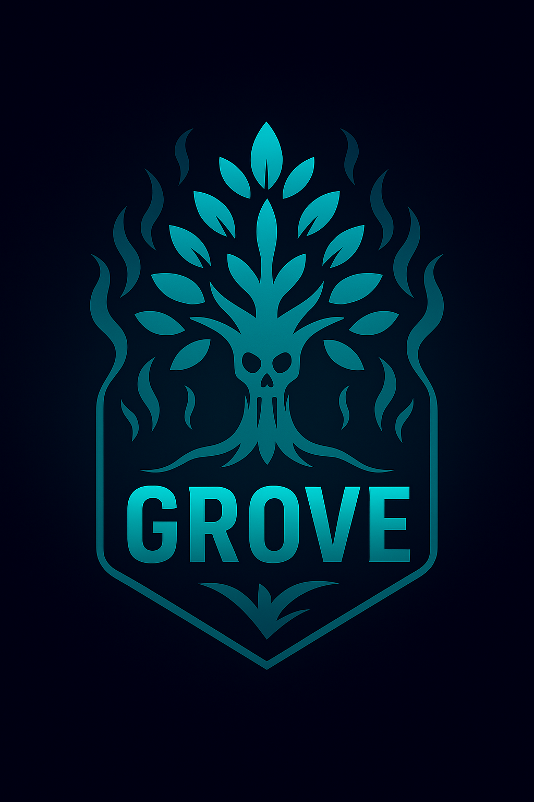

# Grove

<div align="center">
  
</div>

<p align="center">
  
  
  
</p>

A high-performance Tree-sitter wrapper for Zig, designed to provide safe, ergonomic syntax highlighting and parsing for the Grim text editor.

## Overview

Grove is a modern Zig wrapper around the Tree-sitter parsing library, focusing on:

- **Safety**: RAII resource management with no UB on moved trees
- **Performance**: Zero-copy rope integration and incremental parsing
- **Ergonomics**: Clean Zig API over the proven Tree-sitter runtime
- **Integration**: Purpose-built for text editors with LSP support

## Bundled Grammars

Grove ships with **15 production-ready grammars**, all compiled against tree-sitter 0.25.10 (ABI 15):

- **JSON** – `grove.Languages.json.get()` – Configuration and data files
- **Zig** – `grove.Languages.zig.get()` – Zig programming language
- **Rust** – `grove.Languages.rust.get()` – Rust with scanner support
- **Ghostlang** – `grove.Languages.ghostlang.get()` – Ghostlang scripting (`.gla`)
- **TypeScript** – `grove.Languages.typescript.get()` – TypeScript with scanner
- **TSX** – `grove.Languages.tsx.get()` – TypeScript + JSX
- **Bash** – `grove.Languages.bash.get()` – Shell scripting
- **JavaScript** – `grove.Languages.javascript.get()` – JavaScript with scanner
- **Python** – `grove.Languages.python.get()` – Python 3.x
- **Markdown** – `grove.Languages.markdown.get()` – Documentation and prose
- **CMake** – `grove.Languages.cmake.get()` – Build system configuration
- **TOML** – `grove.Languages.toml.get()` – Cargo.toml, pyproject.toml, configs
- **YAML** – `grove.Languages.yaml.get()` – CI/CD, Kubernetes, Docker Compose
- **C** – `grove.Languages.c.get()` – C programming language
- **GShell** – `grove.Languages.gshell.get()` – GShell command syntax

### Ghostlang Support

- **Parser source**: `vendor/tree-sitter-ghostlang/src/parser.c` (statically linked)
- **Queries**: highlights, locals, textobjects, folds, indents, and injections
- **Syntax**: `local` variables/functions, generic `for k, v in` loops, anonymous functions, varargs, method calls, optional chaining (`?.`), nullish coalescing (`??`)
- **File associations**: `.gla`
- **Grammar tests**: 31/31 corpus tests passing

## Project Status

Grove is **RC1 ready** - a production-quality Tree-sitter wrapper for Zig with comprehensive editor integration features.

### Completed

- Zig wrapper over Tree-sitter C runtime (MIT)
- Chunked input adapter for incremental edits (`Parser.parseChunks`)
- Safe parser lifecycle & pooling (`core/pool.zig`)
- Query, highlight, and editor bridges (`grove.Query`, `grove.Editor`)
- Benchmark harness with throughput metrics (`zig build bench`)

## Architecture

Grove is structured in layers:

- **Core**: Safe Zig bindings over Tree-sitter C runtime
- **Editor**: Query engine, highlighting, folding, symbols, and LSP helpers
- **Performance**: Parser pooling, chunked input, incremental parsing

## Capabilities

### Grammar Coverage
- 15 production grammars with highlight queries
- Ghostlang support with `.gla` file associations
- Scanner support for complex grammars (Rust, TypeScript, JavaScript)

### Editor Integration
- Query engine with capture metadata and validation
- Highlight engine mapping captures to editor classes
- Folding ranges, document symbols, hover metadata
- Definition lookup and reference finding
- Syntax error extraction with context

### Performance
- Benchmark harness (`zig build bench`, `zig build bench-latency`)
- Parser pooling for multi-threaded workloads
- Chunked input for rope/streaming integration
- Incremental parsing with <5ms edit latency target

### Quality
- RAII resource management with no UB on moved trees
- Comprehensive test suite
- Error propagation over panics in public API

## Building

Grove requires Zig 0.17.0-dev or later.

```bash
zig build
```

Run the test suite (includes JSON grammar sanity checks):

```bash
zig build test
```

Run the throughput benchmark harness:

```bash
zig build bench
```

Track incremental latency against the <5 ms target:

```bash
zig build bench-latency
```

### Quick Parse Example

```zig
const std = @import("std");
const grove = @import("grove");

pub fn main() !void {
	var gpa = std.heap.GeneralPurposeAllocator(.{}){};
	defer _ = gpa.deinit();

	var parser = try grove.Parser.init(gpa.allocator());
	defer parser.deinit();

	const language = try grove.Languages.json.get();
	try parser.setLanguage(language);

	var tree = try parser.parseUtf8(null, "{\"hello\": true}");
	defer tree.deinit();

	const root = tree.rootNode() orelse return error.EmptyTree;
	std.debug.print("root kind = {s}\n", .{root.kind()});
}
```

## Editor Toolkit

- **Queries**: `grove.Query` and `grove.QueryCursor` wrap Tree-sitter query APIs with Zig safety, capture metadata, and dynamic registry support.
- **Query Validation**: `grove.validateQuery` and `grove.validateQueryFile` check .scm files for errors before runtime.
- **Highlights**: `grove.Highlight.collectHighlights` and `HighlightEngine` map captures to Grim highlight classes.
- **Editor Utilities**: `grove.Editor` exposes `getHighlights`, `getFoldingRanges`, `getDocumentSymbols`, `findDefinition`, and `hover` helpers for LSP plumbing.
- **Error Recovery**: `grove.getSyntaxErrors` extracts ERROR and MISSING nodes with context for diagnostics.
- **Incremental Edits**: `grove.EditBuilder` provides high-level helpers for insertText, deleteRange, and replaceRange operations.
- **Multi-Grammar Support**: `grove.parseWithInjections` handles embedded languages (e.g., code blocks in Markdown, scripts in HTML).
- **Dynamic Grammars**: `grove.LanguageRegistry` registers additional grammars from shared libraries for live grammar swaps.

## Performance Helpers

- **Chunked Input**: `Parser.parseChunks` feeds rope segments or streaming buffers directly into Tree-sitter without concatenation.
- **Timing & Benchmarks**: `Parser.parseUtf8Timed` returns `ParseReport { tree, duration_ns, bytes }` for profiling. `zig build bench` parses bundled Zig sources and prints throughput, while `zig build bench-latency` samples incremental edits.
- **Parser Pooling**: `grove.ParserPool` leases configured parsers across threads, eliminating hot-path reinitialisation overhead.
- **Tree Cloning**: `tree.clone()` creates fast tree copies for undo/redo stacks without re-parsing.

## REPL/Shell Support

Grove includes specialized APIs for interactive shells and REPLs:

- **RealtimeHighlighter**: Sub-5ms highlighting for command-line input with incremental parsing
- **Command Validation**: Validate commands against PATH with custom validator functions
- **Completion Context**: Smart completion context detection (command, flag, file, variable)
- **Error Detection**: Real-time syntax error highlighting as users type

Example usage in a shell:
```zig
const grove = @import("grove");

var highlighter = try grove.RealtimeHighlighter.init(
    allocator,
    try grove.Languages.gshell.get(),
    highlight_query,
);
defer highlighter.deinit();

// Highlight user input in real-time
const spans = try highlighter.highlightLine("ls -la | grep test");

// Validate commands
const validator = struct {
    fn isValid(cmd: []const u8) bool {
        return isInPath(cmd); // Your implementation
    }
}.isValid;

const results = try grove.validateCommands(allocator, root, source, validator);
```

## License

MIT - See LICENSE file for details.

Tree-sitter grammars maintain their original licenses.
